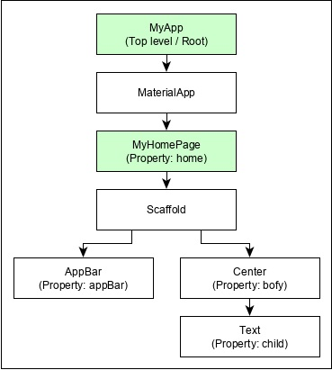

# Простое приложение на Flutter - структура

Создаем виджет MyApp. В него вкладываем виджет MaterialApp.

MaterialApp - в проперти home или ставим кастомный виджет MyHomePage.

Виджет Scaffold - это "строительные леса" для экрана.

[Пример кода](app-basic.md)

[<------------ Индекс ](README.md)