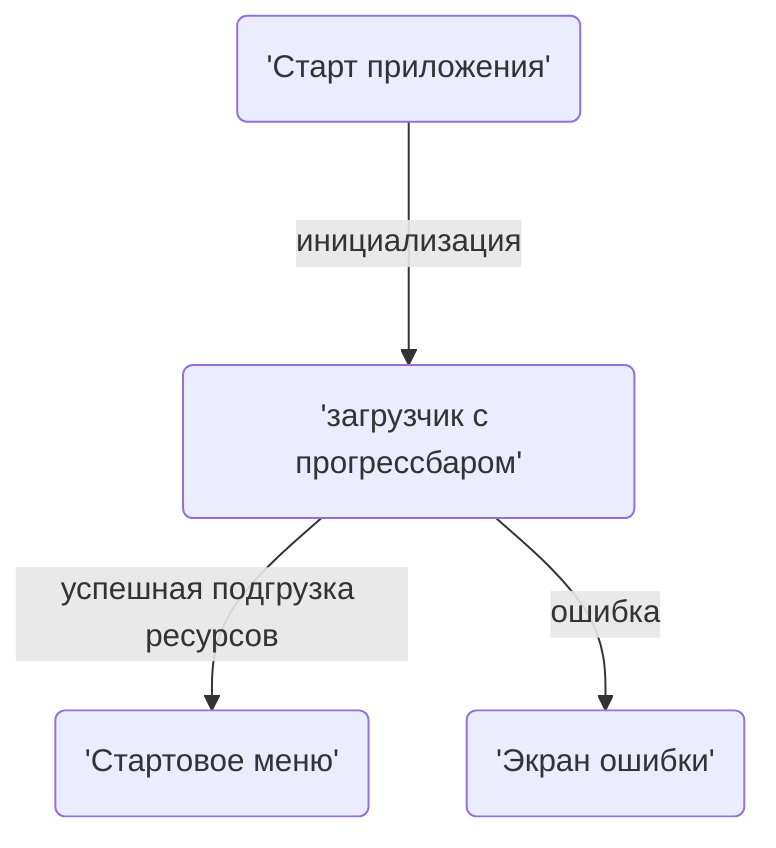

# Mermaid

```mermaid
flowchart TD
   A('Старт приложения') ---> | инициализация | B('загрузчик с прогрессбаром')
   B --> | успешная подгрузка ресурсов | C('Стартовое меню')
   B --> | ошибка | Z('Экран ошибки')
```
