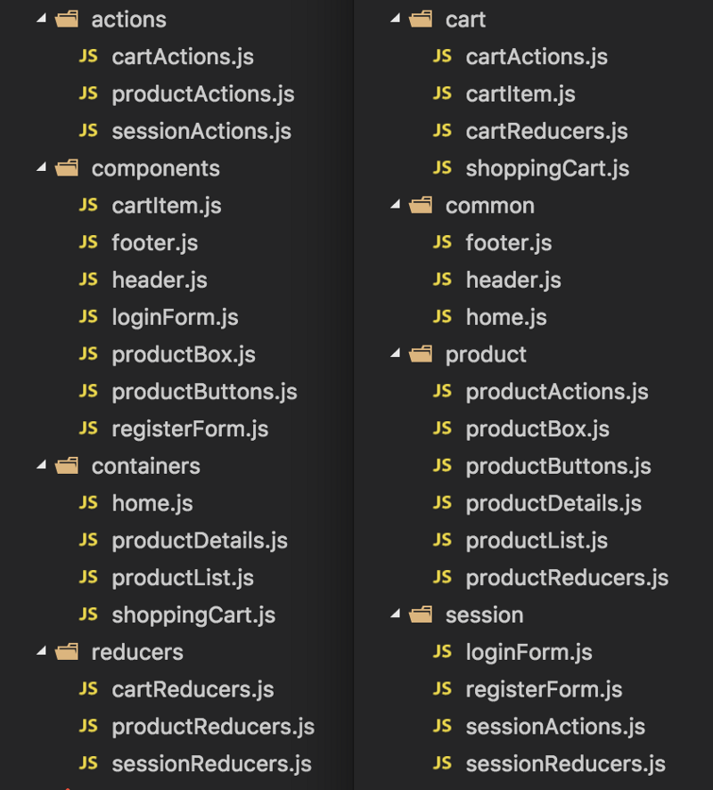

# Масштабирование Redux-приложения с помощью ducks

https://habr.com/ru/company/otus/blog/492638/

## Организация папок

Слева function-first, а справа — feature-first. Первое тяжело масштабировать. Второе - легче. Но во втором случае нет разделения между React/Redux или другой системой управления состоянием.



## Отделяем state от view

Внутри view делаем разделение на feature-first. А что делать в state?

## feature-first - re-ducks

Re-ducks подход - пишем папку для стейтов redux. Внутри redux пишем папки по фичам. Внутри папки с фичей пишем

```
feature/
├── actions.js // action creator, функции
├── index.js
├── operations.js // цепные операции, redux middleware
├── reducers.js
├── selectors.js // функции проверки state. Чекеры
├── tests.js
├── types.js  // имена actions
├── utils.js
```

Это duck-папка.

## Duck - это feature-папка

Она должна

- Содержать всю логику обработки только ОДНОГО концепта вашего приложения, например: product, cart, session и т.д.
- Содержать файл index.js, который экспортируется в соответствии с правилами duck.
- Хранить в одном файле код, который выполняет аналогичную работу, например reducers, selectors и actions.
- Содержать тесты, относящиеся к duck.
